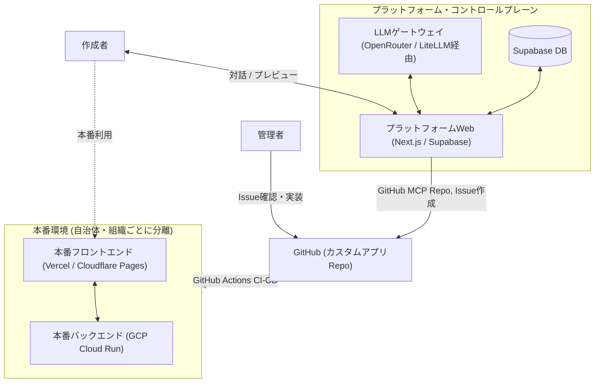
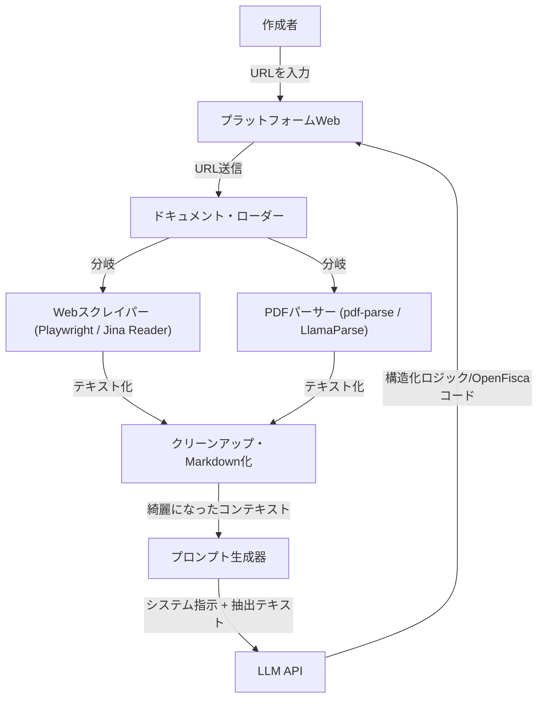
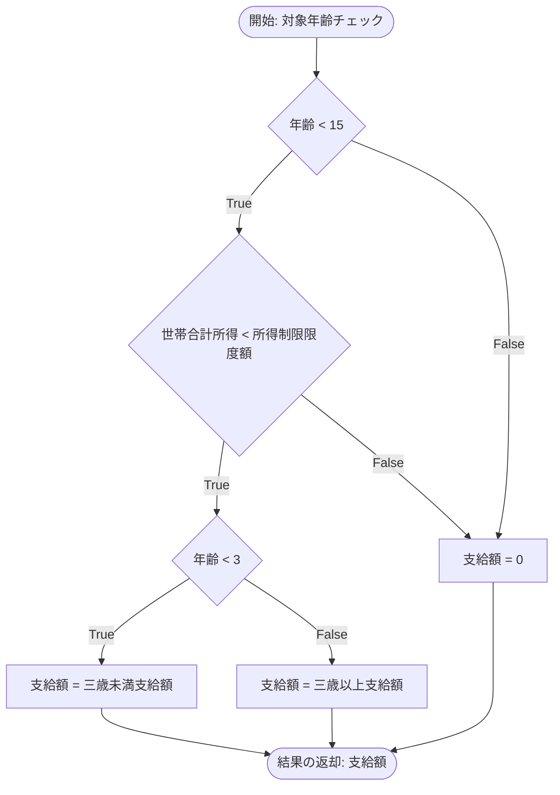
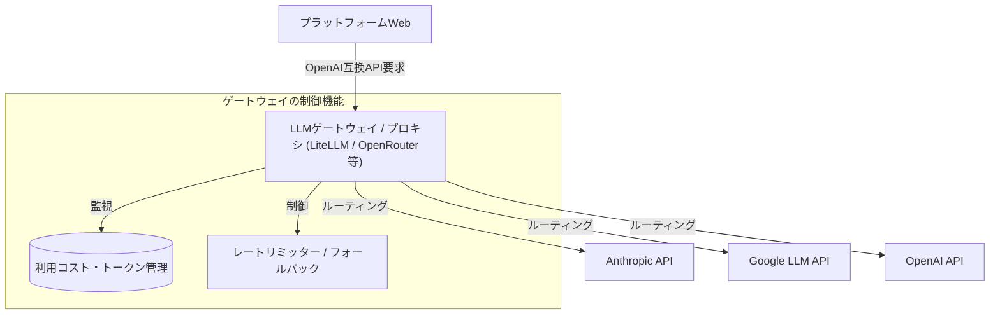

# ヤドカリプラットフォーム：システム設計・アーキテクチャ提案

## 1. 目的・概要
非エンジニアでもカスタムで制度追加したミニヤドカリくんアプリ（カスタムアプリ）を作れるようなプラットフォームを作りたい。
* ベース：現在の `OpenFisca-Japan`
* 拡張性：カスタムOpenFiscaを派生させ、制度追加し、「支援みつもりヤドカリくん」の簡易版Webアプリまで作れること
* セキュリティの確保（お試しプレビュー vs リソース確保したカスタム利用）
  * ソースコードレベルの分離：ベースの `OpenFisca-Japan` リポジトリとそこから分離・派生したリポジトリ（制度のロジック・パラメータレベル）
  * サーバーレベルの分離

### 1.1. カスタムアプリのバックエンド
* **OpenFiscaのパッケージ階層 ([公式ドキュメント](https://openfisca.org/doc/architecture.html))**:
  * **Coreパッケージ**: API、ドメイン固有言語（DSL）、およびテストツールを提供。
  * **国パッケージ (OpenFisca-Japan)**: parameter (制度の定数)、variable (制度)、entity (世帯・世帯員)を定義（`/Users/naoya/develop/proj-inclusive/OpenFisca-Japan` 以下の `openfisca-japan` ディレクトリで実装）。
  * **拡張パッケージ**: 国パッケージを継承し、parameter, variableを追加・再定義。entityは追加・再定義しない。
* **運用ルール**:
  * 日本の自治体や組織は `OpenFisca-Japan` を継承した拡張パッケージを用いる。
  * 自治体間・組織間では制度を共有しない。共有すべき共通制度は国パッケージに実装する。
  * GitHubのリポジトリも `OpenFisca-Japan` とは別にする。

### 1.2. カスタムアプリのフロントエンド
* `OpenFisca-Japan` に対応している「支援みつもりヤドカリくん」（`/Users/naoya/develop/proj-inclusive/OpenFisca-Japan` 以下の `dashboard` ディレクトリで実装）の簡易版テンプレートを用意。
* 一問一答方式、見積もり結果表示方法など基本的なGUIは同様。
* テーマカラー、ページタイトル、ロゴなどのデザインはカスタム可能にする。

### 1.3. カスタムアプリ作成プラットフォーム

#### 作成者の操作手順
1. **アカウント申請・ログイン**:
   アカウントを作成・申請し、特定のカスタムアプリの作成権限を得てログインする。
2. **制度情報入力**:
   追加したい制度の名称と、計算方法の説明（または説明HPのURL）を入力する。
3. **ロジック確認**:
   計算ロジックの分かりやすい説明と図が表示される。
4. **対話的ブラッシュアップ**:
   対話的にロジックの理解を深め、間違いがあれば自然言語で修正指示を行う。指示に応じて説明と図が更新される。
   * ロジックに誤りがないか
   * コーナーケース、例外ケース、煩雑なケースにどこまで対応するか
   * アプリユーザーに求める必須入力とオプション入力の区別
5. **プレビュー表示**:
   ロジック（バックエンド）の修正完了後、カスタムアプリの一問一答の流れを示すプレビューが表示される。
6. **GUI修正指示**:
   作成者が自然言語でカスタムアプリのGUI修正を指示する。
7. **PR作成**:
   GUI（フロントエンド）の修正が完了したら、公開サーバーへの issue が作成される。
8. **マージ・デプロイ**:
   カスタムアプリ管理者によって issue が確認され、バックエンド・フロントエンド実装のPRを作成し、マージすると、公開サーバーにデプロイされる。(このプラットフォームでは担わない。)

#### プラットフォームの内部挙動
* **認証・権限管理 (Step 0)**:
  Supabaseなどの外部認証基盤を使用。管理者ダッシュボードから申請アカウントへ権限を付与し、ログイン時に認証する。  
  新たなカスタムアプリ名、あるいは既存のカスタムアプリ名をユーザーに入力させる。
* **ロジック解析・生成 (Step 1 & 2)**:
  LLM APIに制度の説明/URLとヤドカリハーネスを入力し、分かりやすい説明とOpenFiscaバックエンド実装のメタデータを出力させる。
  ユーザーにはその説明と、メタデータから自動生成したフローチャートを示す。
  制度のURLが入力された場合、`2. 外部URL・制度資料(PDF)の参照アプローチ`の通りに対象サイトの情報を取得し、LLM APIに入力する。
  * *注意*: API利用料が高騰しないよう、モデルの種別、対話回数、総トークン数の制限を設ける（詳細は後述の「5. 複数LLMプロキシ（OpenRouter風アプローチ）の導入」を参照）。
* **対話的修正 (Step 3)**:
  作成者とLLM APIを媒介し、バックエンド実装のメタデータを修正し、それに基づくフローチャートを更新する。
* **フロントエンド生成・プレビュー (Step 4)**:
  バックエンド実装のメタデータとヤドカリハーネスをLLM APIに入力し、フロントエンド実装のメタデータを出力。メタデータをもとに一問一答の流れをプレビュー的に示す。
* **GUI修正 (Step 5)**:
  作成者とLLM APIを媒介し、フロントエンドのメタデータを修正し、一問一答プレビューを更新する。
* **PR作成 (Step 6)**:
  カスタムアプリのリポジトリを作成し、バックエンド・フロントエンド実装のメタデータを記述した issue を作成（GitHub MCPを使用）。
* **マージ・デプロイ (Step 7)**:
  管理者がissueを確認し、バックエンド・フロントエンドを実装してPull Requestを出す。
  * *検討*: AIエージェントやフロントエンド/バックエンドサーバー（GCP）のMCPを用いてデプロイ工程を一部自動化することも視野に入れるが、このプラットフォームではその工程は行わない。。

---

### 1.4. システム全体アーキテクチャ




---


## 2. 外部URL・制度資料(PDF)の参照アプローチ

ユーザーが入力した「制度説明が記載されているホームページのURL」をLLMに参照させることは**十分に可能**です。ただし、LLMのAPIにURLを直接渡して読み取らせるより、**「プラットフォーム側でURLからテキストを事前に取得し、クリーンアップしてLLMのプロンプト（コンテキスト）に埋め込む」**という前処理（スクレイピング/ドキュメント解析パイプライン）を挟むアプローチが、精度・コスト・安定性のすべての面で圧倒的に推奨されます。

### なぜ前処理（プロキシ）が必要なのか？
1. **日本特有の「PDF資料」への対応**:
   自治体の制度説明ページや規約は、Webページ上ではなく **「PDFの添付ファイル」** で公開されているケースが非常に多いです。LLM APIにURLを直接渡すだけでは、PDFファイルを正しくダウンロードして解析することが困難です。プラットフォーム側でPDFを検知してテキスト抽出する仕組みが必要です。
2. **ノイズの排除（トークン削減と精度向上）**:
   自治体のWebページには、ヘッダー、サイドナビゲーション、フッター、関連リンクなど、制度のロジックとは無関係なノイズが多く含まれます。これらをそのままLLMに投げると、無駄なAPIトークンを消費し、LLMが計算ロジックを誤認する原因になります。
3. **デバッグの容易さと再現性**:
   LLMが「どのテキストデータをインプットとしてコードを生成したのか」をデータベースに保存しておくことで、バグや計算ミスが発生した際の原因究明（LLMの誤認なのか、元データが不足していたのか）が非常に容易になります。

### 具体的な実装フロー



* **Webスクレイパーの選定**: 
  自治体サイトはJavaScriptで後からレンダリングされる場合があるため、`Playwright` や無頭ブラウザ、またはLLMフレンドリーなMarkdownにWebページを変換してくれる外部API（例：`Jina Reader API`）の利用が適しています。
* **PDFパーサーの選定**: 
  表形式で書かれた支給要件などを崩さずにテキスト化するため、`LlamaParse`（高度なレイアウト解析対応）や、シンプルな `pdf-parse` を使って文字情報を抽出します。

---


## 3. バックエンドロジック生成のためのメタデータ設計

openfisca-japan の新しい **variable (変数)**、**parameter (パラメータ)**、および **test (テスト)** を定義し、Agent が安全かつ正確に Python コードや YAML 定義を自動生成できるようにするための JSON フォーマットを以下のように設計する。

### 設計のポイント：Variable ロジックの明確化
OpenFisca の variable 生成で最もエラーが起きやすいのは `formula` 内のベクトル演算ロジックです。この JSON フォーマットでは、以下の2段階に分けてロジックを定義することで、曖昧さを排除し、生成されるコードの正確性を担保します。

1. **`dependencies` (依存関係の明示的な宣言)**
   - 依存する変数やパラメータ、および「世帯員の変数の合計 (`household.sum`)」や「個人から世帯変数の参照 (`person.household`)」などの集約・射影処理を宣言します。
   - これにより、Agent は OpenFisca 固有の複雑な API 呼び出し（`household.members` 等）を自動かつ正確に構築できます。


2. **`nodes` (ノードの定義)**
   このフォーマットでは、ロジックを「条件分岐ノード」と「処理・代入ノード」の有向グラフ（フローチャート）として宣言的に定義します。これにより、**JSON から一意にフローチャート（Mermaid 等）をレンダリングでき、かつAI がそれを安全に OpenFisca のベクトル演算コードへ変換できる**ようになります。

---

### 1. JSON スキーマ

```json
{
  "$schema": "https://json-schema.org/draft/2020-12/schema",
  "title": "OpenFiscaJapanFlowchartSchema",
  "description": "if/else分岐、加減乗除、および集約関数のみで構成され、一意にフローチャート化できるOpenFisca用定義スキーマ",
  "type": "object",
  "required": ["variables", "parameters", "tests"],
  "properties": {
    "variables": {
      "type": "array",
      "items": {
        "$ref": "#/definitions/variable"
      }
    },
    "parameters": {
      "type": "array",
      "items": {
        "$ref": "#/definitions/parameter"
      }
    },
    "tests": {
      "type": "array",
      "items": {
        "$ref": "#/definitions/test_file"
      }
    }
  },
  "definitions": {
    "variable": {
      "type": "object",
      "required": ["name", "value_type", "entity", "definition_period", "label"],
      "properties": {
        "name": { "type": "string", "description": "【必須】日本語の変数名。例: '児童手当支給額'" },
        "label": { "type": "string", "description": "【必須】人間向けの短い説明" },
        "documentation": { "type": "string", "description": "詳細な制度説明" },
        "reference": { "type": "string", "description": "法的根拠URL" },
        "value_type": { "type": "string", "enum": ["float", "int", "bool", "str", "Enum"] },
        "possible_values": {
          "type": "object",
          "description": "Enum型の場合の値リスト。"
        },
        "default_value": { "type": ["string", "number", "boolean"], "description": "Enum型の場合はデフォルトのキー名" },
        "entity": { "type": "string", "enum": ["人物", "世帯"] },
        "definition_period": { "type": "string", "enum": ["DAY", "MONTH", "YEAR", "ETERNITY"] },
        "end": { "type": "string", "description": "制度の廃止日 (YYYY-MM-DD)" },
        "formulas": {
          "type": "object",
          "description": "適用開始日をキーとするロジック定義。通常は '0001-01-01' を使用",
          "additionalProperties": {
            "$ref": "#/definitions/flowchart_formula"
          }
        }
      }
    },
    "flowchart_formula": {
      "type": "object",
      "required": ["dependencies", "start_node", "nodes"],
      "properties": {
        "dependencies": {
          "type": "object",
          "description": "ロジック内で使用する変数とパラメータの宣言",
          "properties": {
            "variables": {
              "type": "array",
              "items": {
                "type": "object",
                "required": ["name", "entity", "period", "required"],
                "properties": {
                  "name": { "type": "string", "description": "日本語の参照変数名" },
                  "as": { "type": "string", "description": "ロジック内で使用する日本語のエイリアス名" },
                  "entity": { "type": "string", "enum": ["person", "household", "household_members"], "description": "参照範囲" },
                  "period": { "type": "string", "description": "参照期間" },
                  "required": { "type": "boolean", "description": "【必須】この変数が入力必須であるか" },
                  "default": { "type": ["string", "number", "boolean"], "description": "requiredがfalseの場合のデフォルト値" }
                },
                "if": {
                  "properties": { "required": { "const": false } }
                },
                "then": {
                  "required": ["default"]
                }
              }
            },
            "parameters": {
              "type": "array",
              "items": {
                "type": "object",
                "required": ["path", "as"],
                "properties": {
                  "path": { "type": "string", "description": "仮の日本語パラメータ名" },
                  "as": { "type": "string", "description": "ロジック内で使用する日本語の変数名" }
                }
              }
            }
          }
        },
        "start_node": { "type": "string", "description": "フローチャートの開始ノード名" },
        "nodes": {
          "type": "object",
          "description": "フローチャートの各ノードの定義（有向グラフ）",
          "additionalProperties": {
            "type": "object",
            "required": ["type"],
            "properties": {
              "type": { "type": "string", "enum": ["conditional", "assignment", "return"] },
              "condition": { "type": "string", "description": "ifの条件式（比較演算子のみ）" },
              "true_node": { "type": "string", "description": "条件が真の時の遷移先" },
              "false_node": { "type": "string", "description": "条件が偽の時の遷移先" },
              "target": { "type": "string", "description": "代入先のローカル変数名" },
              "expression": { 
                "type": "string", 
                "description": "代入式・返却値。使用可能な集約関数: 合計(変数), 最大(変数), 最小(変数), いずれかが真(変数), すべてが真(変数)" 
              },
              "next_node": { "type": "string", "description": "代入後の次の遷移先" }
            }
          }
        }
      }
    },
    "parameter": {
      "type": "object",
      "required": ["path", "description", "unit", "values"],
      "properties": {
        "path": { "type": "string", "description": "仮の日本語パラメータ名" },
        "description": { "type": "string" },
        "unit": { "type": "string", "enum": ["currency-JPY", "/1", "year", "person"] },
        "values": {
          "type": "object",
          "additionalProperties": { "type": "number" }
        }
      }
    },
    "test_file": {
      "type": "object",
      "required": ["file_path", "test_cases"],
      "properties": {
        "file_path": { "type": "string" },
        "test_cases": {
          "type": "array",
          "items": {
            "type": "object",
            "required": ["name", "period", "input", "output"],
            "properties": {
              "name": { "type": "string" },
              "period": { "type": "string" },
              "input": { "type": "object" },
              "output": { "type": "object" }
            }
          }
        }
      }
    }
  }
}

```

---

### 2. 具体的な記述例 (ユースケース: 児童手当の新規追加)

以下は、上記スキーマに準拠して書かれた JSON データです。ロジック部分は `if/else` に相当する分岐ノードの連続として定義され、パラメータのパスは仮の名称になっています。

```json
{
  "variables": [
    {
      "name": "児童手当支給額",
      "label": "対象児童に支給される児童手当の月額",
      "documentation": "児童の年齢と世帯の所得状況に応じて計算される児童手当",
      "value_type": "float",
      "entity": "人物",
      "definition_period": "MONTH",
      "formulas": {
        "2024-04-01": {
          "dependencies": {
            "variables": [
              { 
                "name": "年齢", 
                "entity": "person", 
                "period": "current", 
                "required": true 
              },
              { 
                "name": "所得", 
                "entity": "household_members", 
                "period": "current", 
                "required": false, 
                "default": 0 
              }
            ],
            "parameters": [
              { "path": "パラメータ：三歳未満支給額", "as": "三歳未満支給額" },
              { "path": "パラメータ：三歳以上支給額", "as": "三歳以上支給額" },
              { "path": "パラメータ：所得制限限度額", "as": "所得制限限度額" }
            ]
          },
          "start_node": "世帯合計所得の計算",
          "nodes": {
            "世帯合計所得の計算": {
              "type": "assignment",
              "target": "世帯合計所得",
              "expression": "合計(所得)",
              "next_node": "対象年齢チェック"
            },
            "対象年齢チェック": {
              "type": "conditional",
              "condition": "年齢 < 15",
              "true_node": "所得制限チェック",
              "false_node": "不支給の代入"
            },
            "所得制限チェック": {
              "type": "conditional",
              "condition": "世帯合計所得 < 所得制限限度額",
              "true_node": "乳幼児判定",
              "false_node": "不支給の代入"
            },
            "乳幼児判定": {
              "type": "conditional",
              "condition": "年齢 < 3",
              "true_node": "乳児手当額の代入",
              "false_node": "幼児手当額の代入"
            },
            "乳児手当額の代入": {
              "type": "assignment",
              "target": "支給額",
              "expression": "三歳未満支給額",
              "next_node": "結果の返却"
            },
            "幼児手当額の代入": {
              "type": "assignment",
              "target": "支給額",
              "expression": "三歳以上支給額",
              "next_node": "結果の返却"
            },
            "不支給の代入": {
              "type": "assignment",
              "target": "支給額",
              "expression": "0",
              "next_node": "結果の返却"
            },
            "結果の返却": {
              "type": "return",
              "expression": "支給額"
            }
          }
        }
      }
    }
  ],
  "parameters": [
    {
      "path": "パラメータ：三歳未満支給額",
      "description": "3歳未満の児童に対する支給額",
      "unit": "currency-JPY",
      "values": {
        "2024-04-01": 15000
      }
    },
    {
      "path": "パラメータ：三歳以上支給額",
      "description": "3歳以上の児童に対する支給額",
      "unit": "currency-JPY",
      "values": {
        "2024-04-01": 10000
      }
    },
    {
      "path": "パラメータ：所得制限限度額",
      "description": "児童手当の所得制限限度額",
      "unit": "currency-JPY",
      "values": {
        "2024-04-01": 9600000
      }
    }
  ],
  "tests": [
    {
      "file_path": "openfisca_japan/tests/福祉/児童手当.yaml",
      "test_cases": [
        {
          "name": "児童手当テスト：3歳未満かつ制限内",
          "period": "2024-05",
          "input": {
            "世帯": {
              "親一覧": ["親１"],
              "子一覧": ["子１"]
            },
            "世帯員": {
              "親１": {
                "所得": 5000000
              },
              "子１": {
                "年齢": 1
              }
            }
          },
          "output": {
            "世帯員": {
              "子１": {
                "児童手当支給額": {
                  "2024-05": 15000
                }
              }
            }
          }
        }
      ]
    }
  ]
}

```

---

### 3. フローチャート（可視化）への自動マッピングイメージ

この JSON 構造を持つ `nodes` は、プログラム（またはプラットフォーム側）で機械的に以下のような Mermaid フローチャートへ変換して表示することができます。



このフォーマットを活用することで、対話型の設定フェーズと、その後の Agent によるソースコード（`.py` / `.yaml`）の自動生成フェーズをスムーズかつ安全につなぐことができます。

## 4. フロントエンド質問自動生成のためのメタデータ設計
バックエンドロジック生成によって、ユーザーが入力すべき情報(世帯構成、世帯員の年齢等のvariable)が定まる。
それらをユーザーに尋ねる一問一答フローを定義するメタデータ(マニフェスト)を、アプリ作成者はLLMと対話的に生成する。
マニフェストを受け取ったAIエージェントが、TypeScriptコードやXState定義を機械的に書き換えられるように、以下のメタデータ構造を定義する。

### 4.1 アプリケーション・マニフェスト設計案

```json
{
  "app_metadata": {
    "app_title": "○○市 独自支援みつもりヤドカリくん",
    "theme": {
      "primary_color": "#4f46e5"
    }
  },
  "questions": [
    {
      "id": "見積もりモード",
      "title": "見積もりモード",
      "type": "Selection",
      "options": ["かんたん見積もり", "くわしく見積もり"],
      "target_entities": ["あなた"]
    },
    {
      "id": "寝泊まりしている地域",
      "title": "寝泊まりしている地域",
      "type": "Address",
      "target_entities": ["あなた"]
    },
    {
      "id": "年齢",
      "title": "年齢は何歳ですか？",
      "type": "Age",
      "target_entities": ["あなた", "配偶者", "子ども", "親"]
    },
    {
      "id": "子どもの人数",
      "title": "子どもの人数",
      "type": "PersonNum",
      "target_entities": ["あなた"]
    },
    {
      "id": "病気やけが、障害はありますか？",
      "title": "病気やけが、障害はありますか？",
      "type": "MultipleSelection",
      "options": ["病気がある", "けがをしている", "障害がある"],
      "target_entities": ["あなた", "配偶者"]
    }
  ],
  "flow": {
    "start_state": "見積もりモード",
    "states": {
      "見積もりモード": {
        "nextQuestionKey": "寝泊まりしている地域"
      },
      "寝泊まりしている地域": {
        "nextQuestionKey": "年齢",
        "nextConditions": [
          {
            "target": "年収",
            "guard": { "type": "mode_check", "mode": "かんたん見積もり" }
          }
        ]
      },
      "年齢": {
        "nextQuestionKey": "年収",
        "nextConditions": [
          {
            "target": "changeToNextChild",
            "guard": {
              "type": "loop_check",
              "relation": "子ども",
              "limit_source": "子どもの人数"
            }
          }
        ]
      },
      "子どもの人数": {
        "nextQuestionKey": "親の人数",
        "nextConditions": [
          {
            "target": "changeToChild",
            "guard": {
              "type": "has_members",
              "relation": "子ども",
              "source": "子どもの人数"
            }
          }
        ]
      },
      "changeToChild": {
        "type": "member_transition",
        "relation": "子ども",
        "action": "start",
        "nextQuestionKey": "年齢"
      },
      "changeToNextChild": {
        "type": "member_transition",
        "relation": "子ども",
        "action": "next",
        "nextQuestionKey": "年齢"
      }
    }
  },
  "openfisca_mapping": [
    {
      "question_id": "年齢",
      "openfisca_variable": "誕生年月日",
      "level": "member",
      "transform": "age_to_birthdate"
    },
    {
      "question_id": "年収",
      "openfisca_variable": "収入",
      "level": "member",
      "scale": 10000
    },
    {
      "question_id": "病気やけが、障害はありますか？",
      "level": "member",
      "multiple_selection_map": {
        "病気がある": "病気がある",
        "けがをしている": "けがをしている",
        "障害がある": "障害がある"
      }
    }
  ]
}
```
---

## 5. 複数LLMプロキシ（OpenRouter風アプローチ）の導入

プラットフォームが対話的にロジックを解析・生成するにあたり、特定のLLM（ClaudeやGemini等）のAPIに直接依存するのではなく、**OpenRouterのようなLLMプロキシ/ゲートウェイ（またはアグリゲーター）の仕組み**を導入する。これにより、柔軟なモデル切り替えと運用コストの最適化を実現する。

### 5.1. 導入のメリット
1. **APIインターフェースの統一化**:
   OpenAI互換の統一されたAPIエンドポイントを使用することで、バックエンドコードを変更することなく、Claude 3.5 Sonnet、Gemini 1.5 Pro、GPT-4oなど異なるベンダーのモデルをシームレスに切り替えることができる。
2. **自動フォールバックと冗長化**:
   特定のLLMプロバイダで障害（APIのダウンや一時的なレート制限）が発生した場合に、自動的に別のプロバイダやモデルにフォールバック（切り替え）する仕組みを容易に構築できる。
3. **コスト・パフォーマンスの最適化**:
   タスクの複雑さに応じてモデルを動的に変更できる。例えば、簡単なGUI修正の対話（Step 5）には低コストな軽量モデル（Gemini FlashやGPT-4o-mini）を使用し、複雑なOpenFiscaのロジック解析（Step 2）には高性能なモデル（Claude SonnetやGemini Pro）を呼び出すといったインテリジェントなルーティングが可能になる。
4. **統合的なトークン・コスト管理**:
   プラットフォーム全体のAPIキー管理を一元化し、カスタムアプリ作成者ごとのトークン消費量や利用枠（クォータ）の制限、コスト監視をプロキシ層で一括して実施できる。

### 5.2. 具体的なアーキテクチャ構成案



- **セルフホスト型プロキシの利用（LiteLLMなど）**:
  プロダクション環境でのセキュリティ要件（APIキーの漏洩防止やアクセスログの保持）や閉域網での運用を考慮する場合、オープンソースの `LiteLLM` などをプラットフォームのコントロールプレーン内にデプロイして、OpenRouter相当のプロキシを内製するアプローチが推奨される。
- **外部アグリゲーターの利用 (OpenRouterなど)**:
  検証フェーズや個人・小規模開発においては、OpenRouterなどの外部アグリゲーターサービスを直接利用することで、初期のインフラ構築コストをかけずに複数の最先端モデルへ即座にアクセス可能にする。


