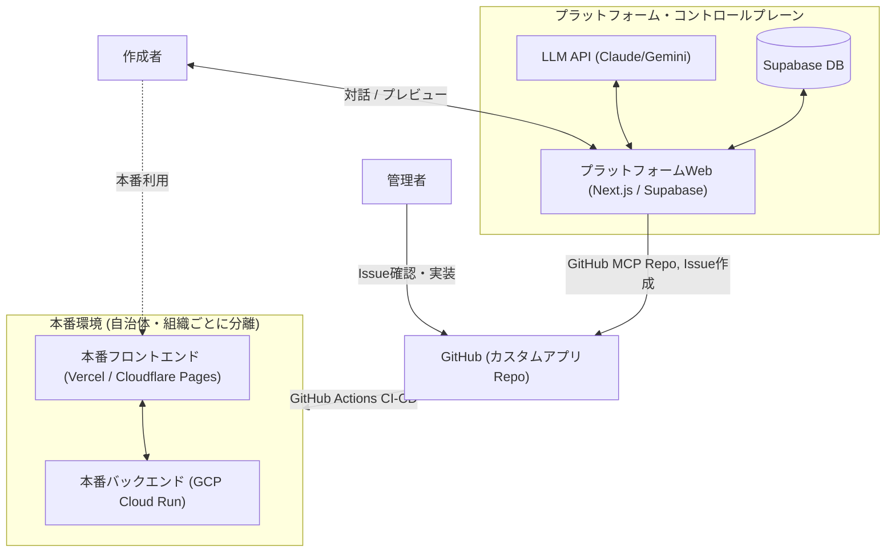
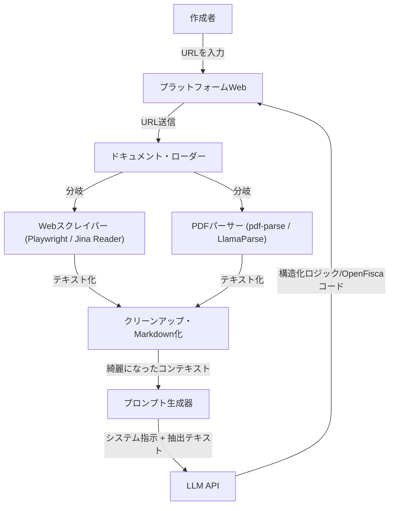

# ヤドカリプラットフォーム：システム設計・アーキテクチャ提案

## 1. 目的・概要
非エンジニアでもカスタムで制度追加したミニヤドカリくんアプリ（カスタムアプリ）を作れるようなプラットフォームを作りたい。
* ベース：現在の `OpenFisca-Japan`
* 拡張性：カスタムOpenFiscaを派生させ、制度追加し、「支援みつもりヤドカリくん」の簡易版Webアプリまで作れること
* セキュリティの確保（お試しプレビュー vs リソース確保したカスタム利用）
  * ソースコードレベルの分離：ベースの `OpenFisca-Japan` リポジトリとそこから分離・派生したリポジトリ（制度のロジック・パラメータレベル）
  * サーバーレベルの分離

### 1.1. カスタムアプリのバックエンド
* **OpenFiscaのパッケージ階層 ([公式ドキュメント](https://openfisca.org/doc/architecture.html))**:
  * **Coreパッケージ**: API、ドメイン固有言語（DSL）、およびテストツールを提供。
  * **国パッケージ (OpenFisca-Japan)**: parameter (制度の定数)、variable (制度)、entity (世帯・世帯員)を定義（`/Users/naoya/develop/proj-inclusive/OpenFisca-Japan` 以下の `openfisca-japan` ディレクトリで実装）。
  * **拡張パッケージ**: 国パッケージを継承し、parameter, variableを追加・再定義。entityは追加・再定義しない。
* **運用ルール**:
  * 日本の自治体や組織は `OpenFisca-Japan` を継承した拡張パッケージを用いる。
  * 自治体間・組織間では制度を共有しない。共有すべき共通制度は国パッケージに実装する。
  * GitHubのリポジトリも `OpenFisca-Japan` とは別にする。

### 1.2. カスタムアプリのフロントエンド
* `OpenFisca-Japan` に対応している「支援みつもりヤドカリくん」（`/Users/naoya/develop/proj-inclusive/OpenFisca-Japan` 以下の `dashboard` ディレクトリで実装）の簡易版テンプレートを用意。
* 一問一答方式、見積もり結果表示方法など基本的なGUIは同様。
* テーマカラー、ページタイトル、ロゴなどのデザインはカスタム可能にする。

### 1.3. カスタムアプリ作成プラットフォーム

#### 作成者の操作手順
1. **アカウント申請・ログイン**:
   アカウントを作成・申請し、特定のカスタムアプリの作成権限を得てログインする。
2. **制度情報入力**:
   追加したい制度の名称と、計算方法の説明（または説明HPのURL）を入力する。
3. **ロジック確認**:
   計算ロジックの分かりやすい説明と図が表示される。
4. **対話的ブラッシュアップ**:
   対話的にロジックの理解を深め、間違いがあれば自然言語で修正指示を行う。指示に応じて説明と図が更新される。
   * ロジックに誤りがないか
   * コーナーケース、例外ケース、煩雑なケースにどこまで対応するか
   * アプリユーザーに求める必須入力とオプション入力の区別
5. **プレビュー表示**:
   ロジック（バックエンド）の修正完了後、カスタムアプリの一問一答の流れを示すプレビューが表示される。
6. **GUI修正指示**:
   作成者が自然言語でカスタムアプリのGUI修正を指示する。
7. **PR作成**:
   GUI（フロントエンド）の修正が完了したら、公開サーバーへの issue が作成される。
8. **マージ・デプロイ**:
   カスタムアプリ管理者によって issue が確認され、バックエンド・フロントエンド実装のPRを作成し、マージすると、公開サーバーにデプロイされる。(このプラットフォームでは担わない。)

#### プラットフォームの内部挙動
* **認証・権限管理 (Step 0)**:
  Supabaseなどの外部認証基盤を使用。管理者ダッシュボードから申請アカウントへ権限を付与し、ログイン時に認証する。
* **ロジック解析・生成 (Step 1 & 2)**:
  LLM APIに制度の説明/URLとヤドカリハーネスを入力し、分かりやすい説明・図示およびOpenFiscaバックエンド実装のメタデータを出力させる。
  * *注意*: API利用料が高騰しないよう、モデルの種別、対話回数、総トークン数の制限を設ける。
* **対話的修正 (Step 3)**:
  作成者とLLM APIを媒介し、説明・図示・バックエンド実装のメタデータを修正する。
* **フロントエンド生成・プレビュー (Step 4)**:
  バックエンド実装のメタデータとヤドカリハーネスをLLM APIに入力し、フロントエンド実装のメタデータを出力。メタデータをもとに一問一答の流れをプレビュー的に示す。
* **GUI修正 (Step 5)**:
  作成者とLLM APIを媒介し、フロントエンドのメタデータを修正。
* **PR作成 (Step 6)**:
  カスタムアプリのリポジトリを作成し、バックエンド・フロントエンド実装のメタデータを記述した issue を作成（GitHub MCPを使用）。
* **マージ・デプロイ (Step 7)**:
  管理者がissueを確認し、バックエンド・フロントエンドを実装してPull Requestを出す。
  * *検討*: AIエージェントやフロントエンド/バックエンドサーバー（GCP）のMCPを用いてデプロイ工程を一部自動化することも視野に入れるが、このプラットフォームではその工程は行わない。。

---

### 1.4. システム全体アーキテクチャ




---


## 2. 外部URL・制度資料(PDF)の参照アプローチ

ユーザーが入力した「制度説明が記載されているホームページのURL」をLLMに参照させることは**十分に可能**です。ただし、LLMのAPIにURLを直接渡して読み取らせるより、**「プラットフォーム側でURLからテキストを事前に取得し、クリーンアップしてLLMのプロンプト（コンテキスト）に埋め込む」**という前処理（スクレイピング/ドキュメント解析パイプライン）を挟むアプローチが、精度・コスト・安定性のすべての面で圧倒的に推奨されます。

### なぜ前処理（プロキシ）が必要なのか？
1. **日本特有の「PDF資料」への対応**:
   自治体の制度説明ページや規約は、Webページ上ではなく **「PDFの添付ファイル」** で公開されているケースが非常に多いです。LLM APIにURLを直接渡すだけでは、PDFファイルを正しくダウンロードして解析することが困難です。プラットフォーム側でPDFを検知してテキスト抽出する仕組みが必要です。
2. **ノイズの排除（トークン削減と精度向上）**:
   自治体のWebページには、ヘッダー、サイドナビゲーション、フッター、関連リンクなど、制度のロジックとは無関係なノイズが多く含まれます。これらをそのままLLMに投げると、無駄なAPIトークンを消費し、LLMが計算ロジックを誤認する原因になります。
3. **デバッグの容易さと再現性**:
   LLMが「どのテキストデータをインプットとしてコードを生成したのか」をデータベースに保存しておくことで、バグや計算ミスが発生した際の原因究明（LLMの誤認なのか、元データが不足していたのか）が非常に容易になります。

### 具体的な実装フロー



* **Webスクレイパーの選定**: 
  自治体サイトはJavaScriptで後からレンダリングされる場合があるため、`Playwright` や無頭ブラウザ、またはLLMフレンドリーなMarkdownにWebページを変換してくれる外部API（例：`Jina Reader API`）の利用が適しています。
* **PDFパーサーの選定**: 
  表形式で書かれた支給要件などを崩さずにテキスト化するため、`LlamaParse`（高度なレイアウト解析対応）や、シンプルな `pdf-parse` を使って文字情報を抽出します。

---


## 3. バックエンドロジック生成のためのメタデータ設計

openfisca-japan の新しい **variable (変数)**、**parameter (パラメータ)**、および **test (テスト)** を定義し、Agent が安全かつ正確に Python コードや YAML 定義を自動生成できるようにするための JSON フォーマットを以下のように設計する。

特に variable のロジック (formula) に関しては、OpenFisca の制約である**「ベクトル演算（`if/else` やスカラー `min/max` の使用禁止、世帯集約メソッドの使用など）」を安全に表現し、曖昧さをなくすための構造**を持たせています。


### 設計のポイント：Variable ロジックの明確化
OpenFisca の variable 生成で最もエラーが起きやすいのは `formula` 内のベクトル演算ロジックです。この JSON フォーマットでは、以下の2段階に分けてロジックを定義することで、曖昧さを排除し、生成されるコードの正確性を担保します。

1. **`dependencies` (依存関係の明示的な宣言)**
   - 依存する変数やパラメータ、および「世帯員の変数の合計 (`household.sum`)」や「個人から世帯変数の参照 (`person.household`)」などの集約・射影処理を宣言します。
   - これにより、Agent は OpenFisca 固有の複雑な API 呼び出し（`household.members` 等）を自動かつ正確に構築できます。
2. **`steps` (ベクトル演算ステップの定義)**
   - 依存関係で定義したローカル変数名を用いて、`where` や `select` などのベクトル演算関数を使った式をステップ順に記述します。
   - スカラーの `if/else` を使わせないように制限された式のみを書くため、安全な NumPy コードが生成されます。


### JSON スキーマ (全体構造)

```json
{
  "$schema": "https://json-schema.org/draft/2020-12/schema",
  "title": "OpenFiscaJapanGenerationSchema",
  "description": "Schema for defining new variables, parameters, and tests to generate code for openfisca-japan.",
  "type": "object",
  "required": ["variables", "parameters", "tests"],
  "properties": {
    "variables": {
      "type": "array",
      "items": {
        "$ref": "#/definitions/variable"
      }
    },
    "parameters": {
      "type": "array",
      "items": {
        "$ref": "#/definitions/parameter"
      }
    },
    "tests": {
      "type": "array",
      "items": {
        "$ref": "#/definitions/test_file"
      }
    }
  },
  "definitions": {
    "variable": {
      "type": "object",
      "required": ["name", "value_type", "entity", "definition_period", "label"],
      "properties": {
        "name": { "type": "string", "description": "変数名 (snake_case)。例: child_allowance_amount" },
        "label": { "type": "string", "description": "短い人間向けの説明" },
        "documentation": { "type": "string", "description": "詳細な説明・仕様" },
        "reference": { "type": "string", "description": "法的根拠URL" },
        "value_type": { "type": "string", "enum": ["float", "int", "bool", "str", "Enum"] },
        "possible_values": {
          "type": "object",
          "description": "value_type が Enum の場合の定義。キーが属性名、値が日本語ラベル。例: {'one': '一等', 'two': '二等'}"
        },
        "default_value": { "type": ["string", "number", "boolean"], "description": "Enumの場合は必須。Enumのキー名を文字列で指定" },
        "entity": { "type": "string", "enum": ["人物", "世帯"] },
        "definition_period": { "type": "string", "enum": ["DAY", "MONTH", "YEAR", "ETERNITY"] },
        "set_input": { "type": "string", "enum": ["divide_by_period", "dispatch_by_period"], "nullable": true },
        "end": { "type": "string", "description": "廃止日 (YYYY-MM-DD)" },
        "formulas": {
          "type": "object",
          "description": "適用開始日をキーとするロジック定義。全期間共通なら '0001-01-01'。法改正対応時は '2020-04-01' 等",
          "additionalProperties": {
            "$ref": "#/definitions/formula_definition"
          }
        }
      }
    },
    "formula_definition": {
      "type": "object",
      "required": ["dependencies", "steps", "return_value"],
      "properties": {
        "dependencies": {
          "type": "object",
          "properties": {
            "variables": {
              "type": "array",
              "items": {
                "type": "object",
                "required": ["name", "entity", "period"],
                "properties": {
                  "name": { "type": "string", "description": "参照する変数名" },
                  "as": { "type": "string", "description": "formula内で使用するローカルエイリアス名（省略時は name と同じ）" },
                  "entity": { "type": "string", "enum": ["person", "household", "household_members"], "description": "person: 本人、household: 所属する世帯、household_members: 世帯員全員" },
                  "period": { "type": "string", "description": "current, last_year, last_3_months, または offset(n, 'month') など" },
                  "aggregate": { "type": "string", "enum": ["sum", "max", "min", "any", "all"], "description": "household_members から集計する際のオペレータ" }
                }
              }
            },
            "parameters": {
              "type": "array",
              "items": {
                "type": "object",
                "required": ["path", "as"],
                "properties": {
                  "path": { "type": "string", "description": "パラメータのパス。例: 福祉.育児.児童手当.金額" },
                  "as": { "type": "string", "description": "formula内で使用するローカル名" }
                }
              }
            }
          }
        },
        "steps": {
          "type": "array",
          "items": {
            "type": "object",
            "required": ["name", "expression"],
            "properties": {
              "name": { "type": "string", "description": "代入する一時変数名" },
              "expression": { 
                "type": "string", 
                "description": "ベクトル演算式。使用できる関数: where, select, min_, max_, not_ などのみ。例: 'where(age < 18, limit_amount, 0)'" 
              }
            }
          }
        },
        "return_value": { "type": "string", "description": "最終的に formula が返す値（変数名または式）" }
      }
    },
    "parameter": {
      "type": "object",
      "required": ["path", "description", "unit", "values"],
      "properties": {
        "path": { "type": "string", "description": "パラメータのツリーパス。例: 福祉.育児.児童手当.金額" },
        "description": { "type": "string", "description": "パラメータの説明" },
        "documentation": { "type": "string", "description": "詳細なドキュメント" },
        "unit": { "type": "string", "enum": ["currency-JPY", "/1", "year", "person"] },
        "type": { "type": "string", "enum": ["marginal_rate", "marginal_amount", "single_amount", "average_rate"], "description": "Scale（累進表）の場合のタイプ" },
        "values": {
          "type": "object",
          "description": "日付 (YYYY-MM-DD) と値のマッピング。値は数値、配列（扶養人数インデックス用）、またはnull（廃止）",
          "additionalProperties": {
            "type": ["number", "array", "null"],
            "items": { "type": "number" }
          }
        },
        "brackets": {
          "type": "array",
          "description": "Scale（累進税率表）を定義する場合に使用。values の代わりに使用する",
          "items": {
            "type": "object",
            "required": ["threshold", "rate_or_amount"],
            "properties": {
              "threshold": { "type": "object", "additionalProperties": { "type": "number" }, "description": "しきい値の日付マッピング" },
              "rate_or_amount": { "type": "object", "additionalProperties": { "type": "number" }, "description": "税率 (rate) または金額 (amount) の日付マッピング" }
            }
          }
        }
      }
    },
    "test_file": {
      "type": "object",
      "required": ["file_path", "test_cases"],
      "properties": {
        "file_path": { "type": "string", "description": "テストYAMLの保存先パス。例: openfisca_japan/tests/福祉/児童手当.yaml" },
        "test_cases": {
          "type": "array",
          "items": {
            "type": "object",
            "required": ["name", "period", "input", "output"],
            "properties": {
              "name": { "type": "string", "description": "テストケース名" },
              "period": { "type": "string", "description": "テスト対象期間。例: 2024-01" },
              "absolute_error_margin": { "type": "number" },
              "relative_error_margin": { "type": "number" },
              "input": { 
                "type": "object", 
                "description": "入力データ。世帯構成（世帯、世帯員、世帯一覧）またはフラットな変数マッピング" 
              },
              "output": { 
                "type": "object", 
                "description": "期待される出力データ。検証対象の変数と期待される値のマップ" 
              }
            }
          }
        }
      }
    }
  }
}
```


### 具体的な記述例：新規機能「児童扶養手当」の追加

以下は、この JSON フォーマットに沿って記述した具体的な定義データの例です。
この JSON を Agent に渡すことで、Agent は [openfisca-variable](file:///Users/naoya/develop/proj-inclusive/OpenFisca-Japan/.agents/skills/openfisca-variable/SKILL.md), [openfisca-parameter](file:///Users/naoya/develop/proj-inclusive/OpenFisca-Japan/.agents/skills/openfisca-parameter/SKILL.md), [openfisca-test](file:///Users/naoya/develop/proj-inclusive/OpenFisca-Japan/.agents/skills/openfisca-test/SKILL.md) の知識を参照しながら、コードを自動生成できます。

```json
{
  "variables": [
    {
      "name": "child_allowance",
      "label": "児童扶養手当の支給額",
      "documentation": "児童の年齢と世帯の所得状況に基づいて計算される児童手当",
      "value_type": "float",
      "entity": "人物",
      "definition_period": "MONTH",
      "formulas": {
        "2024-04-01": {
          "dependencies": {
            "variables": [
              { "name": "age", "entity": "person", "period": "current" },
              { "name": "income", "entity": "household_members", "period": "current", "aggregate": "sum", "as": "household_total_income" }
            ],
            "parameters": [
              { "path": "福祉.育児.児童手当.支給額.三歳未満", "as": "amount_under_three" },
              { "path": "福祉.育児.児童手当.支給額.三歳以上", "as": "amount_over_three" },
              { "path": "福祉.育児.児童手当.所得制限限度額", "as": "income_limit" }
            ]
          },
          "steps": [
            {
              "name": "is_eligible_age",
              "expression": "age < 15"
            },
            {
              "name": "base_amount",
              "expression": "where(age < 3, amount_under_three, amount_over_three)"
            },
            {
              "name": "is_under_limit",
              "expression": "household_total_income < income_limit"
            },
            {
              "name": "final_amount",
              "expression": "is_eligible_age * is_under_limit * base_amount"
            }
          ],
          "return_value": "final_amount"
        }
      }
    }
  ],
  "parameters": [
    {
      "path": "福祉.育児.児童手当.支給額.三歳未満",
      "description": "3歳未満の児童に対する支給額 (月額)",
      "unit": "currency-JPY",
      "values": {
        "2020-01-01": 15000,
        "2024-04-01": 18000
      }
    },
    {
      "path": "福祉.育児.児童手当.支給額.三歳以上",
      "description": "3歳以上15歳未満の児童に対する支給額 (月額)",
      "unit": "currency-JPY",
      "values": {
        "2020-01-01": 10000,
        "2024-04-01": 12000
      }
    },
    {
      "path": "福祉.育児.児童手当.所得制限限度額",
      "description": "児童手当の所得制限限度額",
      "unit": "currency-JPY",
      "values": {
        "2020-01-01": 9600000
      }
    }
  ],
  "tests": [
    {
      "file_path": "openfisca_japan/tests/福祉/児童手当.yaml",
      "test_cases": [
        {
          "name": "児童手当 - 3歳未満、所得制限以下",
          "period": "2024-05",
          "input": {
            "世帯": {
              "親一覧": ["親1"],
              "子一覧": ["子1"]
            },
            "世帯員": {
              "親1": {
                "income": 5000000
              },
              "子1": {
                "birth_date": "2023-05-01",
                "age": 1
              }
            }
          },
          "output": {
            "世帯員": {
              "子1": {
                "child_allowance": {
                  "2024-05": 18000
                }
              }
            }
          }
        }
      ]
    }
  ]
}
```

このフォーマットを活用することで、対話型の設定フェーズと、その後の Agent によるソースコード（`.py` / `.yaml`）の自動生成フェーズをスムーズかつ安全につなぐことができます。

## 4. フロントエンド質問自動生成のためのメタデータ設計

`add_frontend_question.md` および `add-question.md` (AIスキル) に記載されているフロントエンドの実装プロセスを自動化するためには、プラットフォームが「一問一答」の全質問、世帯員構造への割り当て、遷移フロー（条件分岐ガード）、およびOpenFiscaへのマッピングを表現できる**「アプリケーション・マニフェスト（JSON/YAML）」**を出力する必要があります。

このマニフェストを受け取ったAIエージェントが、TypeScriptコードやXState定義を機械的に書き換えられるように、以下のメタデータ構造を定義します。

### 4.1 現状の設計で正しく機能する点（Good Points）
* **コンポーネント生成の不要化**:
  現行のフロントエンドは `question.tsx` によるメタデータ駆動の動的レンダリング（Generic Template）に対応しているため、UIファイルの自動生成は不要であり、マニフェストからの状態定義ファイル生成のみで動作可能です。
* **進捗率計算 (`progress.ts`) の動的対応**:
  `progress.ts` は XState Actor を擬似的に走らせることで進捗ステップ数を算出しているため、マニフェストから `questionState.ts` が正しく生成されていれば、進捗バーのロジックも無修正で自動的に追従します。

### 4.2 コードベースの実装とマニフェスト案のギャップ（改善が必要な点）

#### ギャップA: 質問タイプ（Question Types）の不足
提案のメタデータ案では `Boolean`, `Age`, `AmountOfMoney`, `Selection` の4種類ですが、実際のコードベースには以下の **計7種類** が存在します。
1. `Boolean` (はい / いいえ)
2. `Selection` (単一選択 - `selections` が必要)
3. `MultipleSelection` (複数選択 - `selections` が必要)
4. `Age` (年齢)
5. `AmountOfMoney` (金額 - `unit` が必要)
6. `PersonNum` (人数入力 - 世帯員ループの最大数決定に必須)
7. `Address` (都道府県・市区町村)

> [!IMPORTANT]
> 特に **`PersonNum`** と **`MultipleSelection`** は、世帯員情報の動的生成や複雑な給付条件の判定に直結するため、メタデータ定義に必須です。

#### ギャップB: 世帯員ループ（Member Loops）と状態遷移の表現
コードベースでは、`年齢` などの質問が `あなた` → `配偶者` → `子ども（1人目...N人目）` → `親` のように順番にループして尋ねられます。
XState 上では、これを制御するために `changeToChild` (indexを0に設定) や `changeToNextChild` (indexをインクリメント) などの **ダミーの遷移状態（Member Transition State）** と、ループ継続条件を評価する **ガード条件（`index + 1 < childrenNum` など）** を持っています。
提案のメタデータでは単純なリニア遷移（`nextQuestionKey` のみ）になっており、この **「世帯員ループ」の制御構造** をどう生成ロジックに伝えるかが明記されていません。

#### ギャップC: OpenFisca マッピングの変換ロジック
一問一答の回答から OpenFisca API へのマッピングにおいて、単純な値の代入ではない以下の変換ルールが存在します。
1. **単位変換 (Scaling)**: `AmountOfMoney` は UI 上では「万円」単位ですが、OpenFisca には「円」に変換（10,000倍）して送る必要があります。
2. **日付変換 (Age to Birthdate)**: `Age`（年齢）は、OpenFisca の変数 `誕生年月日` (ETERNITY) に対し、`現在のシミュレーション年 - 回答年齢` の形式（例: `2008-01-01`）で変換してマッピングします。
3. **複数選択のフラグ化 (MultipleSelection Map)**: `MultipleSelection` の回答配列（例: `["病気がある", "障害がある"]`）は、OpenFisca 側では個別の Boolean 変数（例: `業務によって病気になった: true`, `業務によってけがをした: false`）にマップされます。

### 4.3 改善されたアプリケーション・マニフェスト設計案 (`app_manifest.json`)

上記のギャップを解消し、AIジェネレータが機械的に `questionState.ts` や `convert.ts` を出力できるように拡張したスキーマ設計案です。

```json
{
  "app_metadata": {
    "app_title": "○○市 独自支援みつもりヤドカリくん",
    "theme": {
      "primary_color": "#4f46e5"
    }
  },
  "questions": [
    {
      "id": "見積もりモード",
      "title": "見積もりモード",
      "type": "Selection",
      "options": ["かんたん見積もり", "くわしく見積もり", "能登半島地震被災者支援制度見積もり"],
      "target_entities": ["あなた"]
    },
    {
      "id": "寝泊まりしている地域",
      "title": "寝泊まりしている地域",
      "type": "Address",
      "target_entities": ["あなた"]
    },
    {
      "id": "年齢",
      "title": "年齢は何歳ですか？",
      "type": "Age",
      "target_entities": ["あなた", "配偶者", "子ども", "親"]
    },
    {
      "id": "子どもの人数",
      "title": "子どもの人数",
      "type": "PersonNum",
      "target_entities": ["あなた"]
    },
    {
      "id": "病気やけが、障害はありますか？",
      "title": "病気やけが、障害はありますか？",
      "type": "MultipleSelection",
      "options": ["病気がある", "けがをしている", "障害がある"],
      "target_entities": ["あなた", "配偶者"]
    }
  ],
  "flow": {
    "start_state": "見積もりモード",
    "states": {
      "見積もりモード": {
        "nextQuestionKey": "寝泊まりしている地域"
      },
      "寝泊まりしている地域": {
        "nextQuestionKey": "年齢",
        "nextConditions": [
          {
            "target": "年収",
            "guard": { "type": "mode_check", "mode": "かんたん見積もり" }
          }
        ]
      },
      "年齢": {
        "nextQuestionKey": "年収",
        "nextConditions": [
          {
            "target": "changeToNextChild",
            "guard": {
              "type": "loop_check",
              "relation": "子ども",
              "limit_source": "子どもの人数"
            }
          }
        ]
      },
      "子どもの人数": {
        "nextQuestionKey": "親の人数",
        "nextConditions": [
          {
            "target": "changeToChild",
            "guard": {
              "type": "has_members",
              "relation": "子ども",
              "source": "子どもの人数"
            }
          }
        ]
      },
      "changeToChild": {
        "type": "member_transition",
        "relation": "子ども",
        "action": "start",
        "nextQuestionKey": "年齢"
      },
      "changeToNextChild": {
        "type": "member_transition",
        "relation": "子ども",
        "action": "next",
        "nextQuestionKey": "年齢"
      }
    }
  },
  "openfisca_mapping": [
    {
      "question_id": "年齢",
      "openfisca_variable": "誕生年月日",
      "level": "member",
      "transform": "age_to_birthdate"
    },
    {
      "question_id": "年収",
      "openfisca_variable": "収入",
      "level": "member",
      "scale": 10000
    },
    {
      "question_id": "病気やけが、障害はありますか？",
      "level": "member",
      "multiple_selection_map": {
        "病気がある": "病気がある",
        "けがをしている": "けがをしている",
        "障害がある": "障害がある"
      }
    }
  ]
}
```

### 4.4 `add_frontend_question.md` に基づく各ファイル生成・更新ルール

1. **`dashboard/src/state/questionDefinition.ts` の生成（定義）**
   * マニフェストの `questions` の各要素の `type` に応じて、対応する定義オブジェクト（`booleanQuestionDefinitions`, `selectionQuestionDefinitions` 等）に追記します。
   * **7種類の質問タイプ完全対応**:
     * `Boolean`: はい/いいえのトグル。
     * `Selection` / `MultipleSelection`: `options` 配列の内容を `selections` フィールドとして割り当てた TypeScript オブジェクトを構築します。
     * `Age`: 数値入力（年齢）。
     * `AmountOfMoney`: 数値入力（金額）。
     * `PersonNum`: 数値入力（人数）。
     * `Address`: 都道府県・市区町村選択肢の自動取得テンプレート用。

2. **`dashboard/src/state/questionState.ts` の生成（遷移と初期値）**
   * **Context（世帯員配列対応）の初期化**:
     XState の `context` は世帯員区分（`あなた`, `配偶者`, `子ども`, `親`）ごとの配列構造をとります。
     * マニフェストの `questions` の `target_entities` に `"あなた"` が含まれている場合は、`あなた` 配列の第0要素に初期状態オブジェクト（例: `{ type: 'Age', selection: undefined }`）を生成します。
     * それ以外の世帯員キー（`配偶者`, `子ども`, `親`）に対しては、初期状態では空配列 `[]` として生成します。
   * **世帯員ループと状態遷移（XState Guard）**:
     `flow.states` の定義から XState のステート定義コードを構築します。
     * **通常の状態**: `actionObj` 関数を用いて、回答の代入処理および履歴保存アクションを伴う transition を構成します。
     * **世帯員切り替えダミーステップ (`member_transition`)**:
       `"type": "member_transition"` が指定された状態は、以下のように XState の `always` 遷移と `exit` 時の `currentMember` 上書きアクション（`assign`）として構築します。
       ```typescript
       changeToChild: {
         always: { target: '年齢' },
         exit: assign({
           currentMember: () => ({ relationship: '子ども', index: 0 })
         })
       }
       ```
     * **ループ制御ガード条件**:
       `loop_check` などのガード型は、以下のような JavaScript コードに自動展開します。
       ```typescript
       // loop_check (子ども用)
       guard: ({ context }) => {
         const limit = context['子どもの人数'].あなた[0]?.selection;
         const current = context.currentMember;
         return limit != null && current.relationship === '子ども' && current.index + 1 < limit;
       }
       ```

3. **`dashboard/src/state/convert.ts` の生成（マッピング）**
   * `openfisca_mapping` のルールに基づき、画面で入力された型から OpenFisca API への送信形式へ変換する TypeScript コードを生成します。
   * **高度な変換処理のサポート**:
     * **単位変換（`scale`）**: 金額入力などの `scale: 10000` 指定に基づき、単位を「万円」から「円」にスケールする乗算コードを生成します。
     * **年齢・日付変換（`transform: "age_to_birthdate"`）**: 回答された年齢数値から `ETERNITY` 向け誕生年月日（`誕生年月日: { ETERNITY: "YYYY-01-01" }`）を逆算するコードに変換します。
     * **複数選択展開（`multiple_selection_map`）**: `MultipleSelection` 型の回答（配列）について、個別の Boolean OpenFisca 変数に展開マッピングするロジックを出力します。

4. **テストコード群の自動更新**
   * `convert.test.ts` 内の `defaultContext()` への初期プロパティ値の自動追加。
   * `questionState.test.ts` 内の `skipUntil` ヘルパー関数のステップ配列への自動挿入。マニフェストから自動計算されたトポロジカル順序に従いテスト内のダミーステップを挟み込みます。

### 4.5 生成スクリプト（AIエージェント）への追加指示ルール

もしこのメタデータ設計を採用する場合、AIスキルや手順書に以下のルールを追加することを提案します。

1. **Context 初期化ルール**:
   * マニフェストの `questions` の `target_entities` に `"あなた"` が含まれている場合は、`あなた` キーに `{ type: <Type>, selection: undefined }` を初期値として設定する。
   * それ以外の `配偶者`, `子ども`, `親` などのキーに対しては空配列 `[]` で初期化する（ループ処理によって動的に格納されるため）。
2. **XState 状態マシンの遷移ルール**:
   * `"type": "member_transition"` が指定されている状態は、通常の `actionObj` ではなく、以下のような `always` 遷移と `exit` 時の `currentMember` 書き換え処理（`assign`）を生成する。
3. **マッピングコードの変換ルール**:
   * `transform: "age_to_birthdate"` が指定された項目は、年数を引き算して誕生年月日を近似するロジック（`birthYear = currentYear - age`）を `convert.ts` に出力する。
   * `multiple_selection_map` が指定された項目は、配列の中に特定の値が含まれているか (`includes`) を評価して個別 Boolean 変数に代入するコードを出力する。

### 4.6 プラットフォームが作成するメリット
* **UIコード変更なしの動作保証**:
  現行アプリは `question.tsx` による汎用（メタデータ駆動）レンダリングへ移行済みであるため、Reactコンポーネントファイルを新規に作成する必要はありません。プラットフォーム側は **「データ定義と遷移フロー（JSON）」のみを出力・管理すれば良い** ため、フロントエンド側のバグの発生確率を大幅に低減できます。
* **対話時のプレビューエミュレート**:
  本物のコードをビルドする前に、この `app_manifest.json` をブラウザ（プレビュー環境）の軽量な擬似ステートマシンで動かすことで、一問一答の流れやカラーテーマをリアルタイムで動作させ、作成者に確認させることができます。