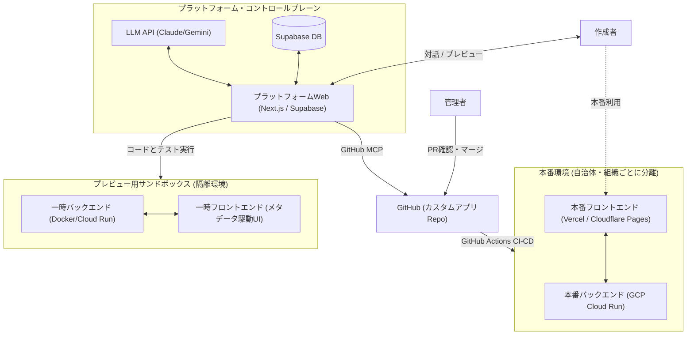
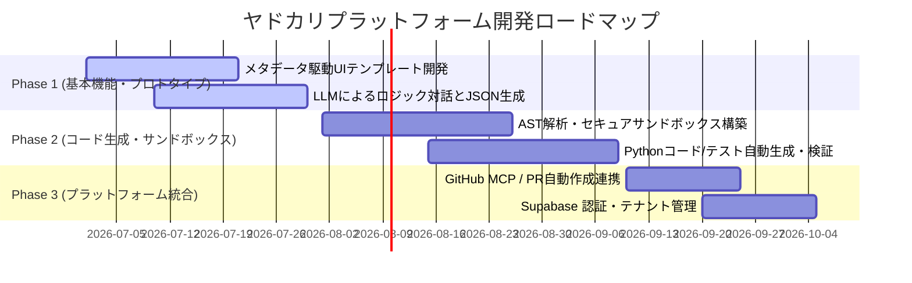
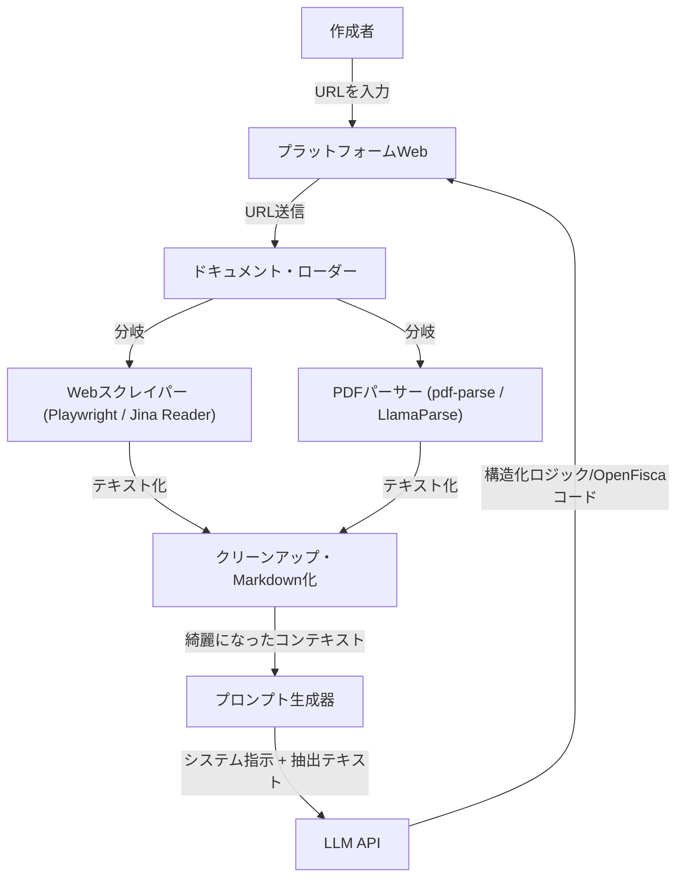

# ヤドカリプラットフォーム：システム設計・アーキテクチャ提案

## ユーザー提案プラン

### 1. 目的・方針
非エンジニアでもカスタムで制度追加したミニヤドカリくんアプリ（カスタムアプリ）を作れるようなプラットフォームを作りたい。
* ベース：現在の `OpenFisca-Japan`
* 拡張性：カスタムOpenFiscaを派生させ、制度追加し、「支援みつもりヤドカリくん」の簡易版Webアプリまで作れること
* セキュリティの確保（お試しプレビュー vs リソース確保したカスタム利用）
  * ソースコードレベルの分離：ベースの `OpenFisca-Japan` リポジトリとそこから分離・派生したリポジトリ（制度のロジック・パラメータレベル）
  * サーバーレベルの分離

### 2. カスタムアプリのバックエンド
* **OpenFiscaのパッケージ階層 ([公式ドキュメント](https://openfisca.org/doc/architecture.html))**:
  * **Coreパッケージ**: API、ドメイン固有言語（DSL）、およびテストツールを提供。
  * **国パッケージ (OpenFisca-Japan)**: parameter (制度の定数)、variable (制度)、entity (世帯・世帯員)を定義（`/Users/naoya/develop/proj-inclusive/OpenFisca-Japan` 以下の `openfisca-japan` ディレクトリで実装）。
  * **拡張パッケージ**: 国パッケージを継承し、parameter, variableを追加・再定義。entityは追加・再定義しない。
* **運用ルール**:
  * 日本の自治体や組織は `OpenFisca-Japan` を継承した拡張パッケージを用いる。
  * 自治体間・組織間では制度を共有しない。共有すべき共通制度は国パッケージに実装する。
  * GitHubのリポジトリも `OpenFisca-Japan` とは別にする。

### 3. カスタムアプリのフロントエンド
* `OpenFisca-Japan` に対応している「支援みつもりヤドカリくん」（`/Users/naoya/develop/proj-inclusive/OpenFisca-Japan` 以下の `dashboard` ディレクトリで実装）の簡易版テンプレートを用意。
* 一問一答方式、見積もり結果表示方法など基本的なGUIは同様。
* テーマカラー、ページタイトル、ロゴなどのデザインはカスタム可能にする。

### 4. カスタムアプリ作成プラットフォーム

#### 作成者の操作手順
1. **アカウント申請・ログイン**:
   アカウントを作成・申請し、特定のカスタムアプリの作成権限を得てログインする。
2. **制度情報入力**:
   追加したい制度の名称と、計算方法の説明（または説明HPのURL）を入力する。
3. **ロジック確認**:
   計算ロジックの分かりやすい説明と図が表示される。
4. **対話的ブラッシュアップ**:
   対話的にロジックの理解を深め、間違いがあれば自然言語で修正指示を行う。指示に応じて説明と図が更新される。
   * ロジックに誤りがないか
   * コーナーケース、例外ケース、煩雑なケースにどこまで対応するか
   * アプリユーザーに求める必須入力とオプション入力の区別
5. **プレビュー表示**:
   ロジック（バックエンド）の修正完了後、カスタムアプリのプレビューが表示される。
6. **GUI修正指示**:
   作成者が自然言語でカスタムアプリのGUI修正を指示する。
7. **PR作成**:
   GUI（フロントエンド）の修正が完了したら、公開サーバーへの Pull Request（PR）が作成される。
8. **マージ・デプロイ**:
   カスタムアプリ管理者によってPRがマージされると、公開サーバーに自動デプロイされる。

#### プラットフォームの内部挙動
* **認証・権限管理 (Step 0)**:
  Supabaseなどの外部認証基盤を使用。管理者ダッシュボードから申請アカウントへ権限を付与し、ログイン時に認証する。
* **ロジック解析・生成 (Step 1 & 2)**:
  LLM APIに制度の説明/URLとヤドカリハーネスを入力し、分かりやすい説明・図示（Mermaid記法等）およびOpenFiscaバックエンド実装を出力させる。
  * *注意*: API利用料が高騰しないよう、モデルの種別、対話回数、総トークン数の制限を設ける。
  * *検討*: クラウド上のAIエージェントがテストにパスするコードを作成してもよいが、待ち時間とコストが懸念される。
* **対話的修正 (Step 3)**:
  作成者とLLM APIを媒介し、説明・図示・バックエンド実装を修正する。
* **フロントエンド生成・プレビュー (Step 4)**:
  バックエンド実装とヤドカリハーネスをLLM APIに入力し、フロントエンド実装を出力。テンプレートを用いてプレビューを表示する。
  * *検討*: クラウド上のAIエージェントがテストにパスするコードを作成してもよいが、待ち時間とコストが懸念される。
* **GUI修正 (Step 5)**:
  作成者とLLM APIを媒介し、フロントエンドを修正。
* **PR作成 (Step 6)**:
  カスタムアプリのリポジトリを作成し、バックエンド・フロントエンド実装の PR を作成（GitHub MCPを使用）。
* **マージ・デプロイ (Step 7)**:
  管理者がPRを確認・修正してマージ。
  * *検討*: AIエージェントやフロントエンド/バックエンドサーバー（GCP）のMCPを用いてデプロイ工程を一部自動化することも視野に入れる。

---


このプランを現実的かつセキュア、そして低コストで具体化するために、技術的な注意点、より良い代替案、具体的なシステム設計案を深く検討しました。

---

## 1. システム全体アーキテクチャ

ご提示いただいた要件を基に、セキュリティとリソースの分離、プレビューと本番環境の切り分けを考慮したアーキテクチャを設計しました。



---

## 2. 4つの核心的な注意点と「より良い方法 (提案)」

### ① セキュリティ：任意のコード生成に伴う「リモートコード実行 (RCE)」リスク
* **【注意点】**  
  非エンジニアが定義したロジックからLLMが Python（OpenFisca）コードを自動生成し、それをサーバーで実行する際、LLMが誤って（あるいはプロンプトインジェクション等によって意図的に）システム破壊やデータ漏洩を行うコード（例：`os.system("rm -rf /")` や環境変数の読み出し）を生成・実行するリスクがあります。
* **【より良い方法】**
  1. **AST（抽象構文木）による静的解析チェック**：  
     生成されたPythonコードを実行する前に、プラットフォーム側でPythonの `ast` モジュール等を用いて解析し、`import` できるライブラリを制限（`openfisca_core` 内のDSLのみ許可）し、組み込み関数（`eval`, `exec`, `open` 等）の利用を厳格に禁止します。
  2. **完全分離されたサンドボックス実行**：  
     テストやプレビュー用のバックエンド実行環境は、本番やプラットフォームの基盤から完全にネットワーク的・物理的に隔離された環境（例：GCP Cloud Runの極小インスタンス、AWS Lambda、または WASM（WebAssembly）上でPythonを動かす Pyodide など）で実行します。

### ② コストと応答遅延：リアルタイムのコード生成・テスト実行ループの限界
* **【注意点】**  
  対話（手順1〜3）の段階で、ユーザーの入力のたびに「LLMがPythonコードを生成 → テストコードを生成 → 実行して検証」というループを回すと、1回の返答に数分かかり、ユーザー体験（UX）が極めて悪くなります。また、LLM APIの消費トークンも跳ね上がります。
* **【より良い方法 (2段階生成アプローチ)】**
  * **第一段階（リアルタイム対話）**：  
    LLMは「Pythonコード」ではなく、**「制度の構造スキーマ (JSON)」**と**「Mermaidの図」**のみを生成・修正します。
    * *JSONスキーマ例*：入力変数名（年齢、年収など）、計算式（`A * B` のような簡易表現）、出力変数。
    * このJSONを基に、フロントエンドは「モック（擬似）プレビュー」を即座に表示します（数秒で応答可能）。
  * **第二段階（非同期ビルド＆テスト）**：  
    ユーザーがロジックに納得し、「アプリをビルド（手順4）」と指示したタイミングで、バックグラウンドのAIエージェントが動き出します。ここで初めて、確定したJSONスキーマから実際の OpenFisca Python コードとテストコードを生成し、テストを実行します。

### ③ フロントエンド：「コード生成」から「メタデータ（設定）駆動UI」への転換
* **【注意点】**  
  LLMにReactやVueなどのフロントエンドコード（GUI）を毎回ゼロから生成させると、レイアウトが崩れたり、状態管理のバグが発生したりして、メンテナンスが不可能になります。
* **【より良い方法】**  
  フロントエンドは「コード生成」ではなく、**「メタデータ駆動（設定ファイル駆動）UI」**にします。
  * 「支援みつもりヤドカリくん」のUI本体は、共通のパッケージ（テンプレート）として固定しておきます。
  * LLMは、そのテンプレートが読み込む **`config.json`（テーマカラー、ロゴ、質問の流れ、入力項目の順序など）** のみを生成・編集します。
  * これにより、GUIの崩れやJavaScriptのバグは100%回避でき、作成者は安全にテーマカラーや質問順序をカスタマイズできます。

### ④ テスト自動化：「ヤドカリハーネス」の具体的な仕組み
* **【注意点】**  
  非エンジニアが作るからこそ、計算ロジックが正しいかのテストが極めて重要です。しかし、テストケース自体を作成者が書くことはできません。
* **【より良い方法】**
  * LLMに「制度のロジック説明」を元に、**「テストシナリオ（例：単身・年収300万の場合は支給額10万円、夫婦・子1人・年収600万の場合は支給額5万円）」** というテストケースのパターン（JSON）を自動生成させます。
  * これを「ヤドカリハーネス」として、生成したOpenFiscaコードに対して自動実行し、すべてパスすることを確認した上でプレビューおよびPRを作成します。

---

## 3. 具体的な実装・データ構造のイメージ

### A. 制度の構造定義（プラットフォーム管理用JSON）
LLMが対話中に編集する、中間的な制度構造定義のイメージです。

```json
{
  "benefit_id": "custom_child_allowance",
  "name": "独自児童手当",
  "description": "国の児童手当に加えて、自治体独自で支給する手当",
  "variables": {
    "inputs": [
      { "name": "age", "type": "integer", "label": "子供の年齢", "max": 18 },
      { "name": "parent_income", "type": "integer", "label": "扶養者の所得" }
    ],
    "outputs": [
      { "name": "allowance_amount", "type": "integer", "label": "支給額" }
    ]
  },
  "logic_rules": [
    "扶養者の所得が 8,000,000円 以上の場合は支給対象外 (0円)",
    "子供の年齢が 6歳未満の場合は 月額 10,000円",
    "子供の年齢が 6歳以上 18歳以下の場合は 月額 5,000円"
  ]
}
```

### B. フロントエンド設定ファイル (UIカスタマイズ用JSON)
LLMまたは作成者がGUIカスタマイズ画面で編集する設定のイメージです。

```json
{
  "theme": {
    "primary_color": "#4f46e5",
    "background_color": "#f8fafc",
    "logo_url": "https://example.com/logo.png"
  },
  "app_title": "○○市 独自支援みつもりヤドカリくん",
  "steps": [
    {
      "step_id": "step_1",
      "title": "世帯の状況",
      "questions": [
        { "variable": "parent_income", "type": "number", "text": "生計維持者の前年の所得はいくらですか？" }
      ]
    },
    {
      "step_id": "step_2",
      "title": "お子様の状況",
      "questions": [
        { "variable": "age", "type": "number", "text": "お子様の年齢は何歳ですか？" }
      ]
    }
  ]
}
```

---

## 4. 開発・具体化ロードマップ (3つのフェーズ)

まずはリスクと開発コストを抑えるため、段階的なリリースを推奨します。



### フェーズ 1: 【基盤構築】メタデータ駆動UI ＆ スキーマ対話
* **ゴール**：コード生成を行わず、「設定JSON」をLLMと対話生成し、それを読み込んで動く「見つもりUI（フロントエンド）」のモックを完成させる。
* **メリット**：セキュアであり、バグのリスクを最小限に抑えて「対話からアプリが作れる」体験を素早く検証可能。

### フェーズ 2: 【バックエンド統合】OpenFiscaコード生成 ＆ サンドボックス
* **ゴール**：LLMがJSONスキーマから実際の OpenFisca-Japan 拡張パッケージの Python コードとテストコードを生成し、セキュアなサンドボックス環境で自動テストをパスさせる仕組みを構築。
* **メリット**：シミュレーション計算の正確性が保証され、実際のOpenFiscaエンジンで動くプレビューが完成する。

### フェーズ 3: 【リリース自動化】GitHub MCP ＆ 管理画面
* **ゴール**：Supabaseでのアカウント・権限管理と、GitHub MCPを用いたPR自動作成、GitHub Actionsによるホスティング環境（Cloud Run / Vercel）への自動デプロイラインを統合。
* **メリット**：プラットフォームとしてのライフサイクル（作成 → テスト → 承認 → 公開）が完全に自動化される。

---

## 5. 外部URL・制度資料(PDF)の参照アプローチ

ユーザーが入力した「制度説明が記載されているホームページのURL」をLLMに参照させることは**十分に可能**です。ただし、LLMのAPIにURLを直接渡して読み取らせるより、**「プラットフォーム側でURLからテキストを事前に取得し、クリーンアップしてLLMのプロンプト（コンテキスト）に埋め込む」**という前処理（スクレイピング/ドキュメント解析パイプライン）を挟むアプローチが、精度・コスト・安定性のすべての面で圧倒的に推奨されます。

### なぜ前処理（プロキシ）が必要なのか？
1. **日本特有の「PDF資料」への対応**:
   自治体の制度説明ページや規約は、Webページ上ではなく **「PDFの添付ファイル」** で公開されているケースが非常に多いです。LLM APIにURLを直接渡すだけでは、PDFファイルを正しくダウンロードして解析することが困難です。プラットフォーム側でPDFを検知してテキスト抽出する仕組みが必要です。
2. **ノイズの排除（トークン削減と精度向上）**:
   自治体のWebページには、ヘッダー、サイドナビゲーション、フッター、関連リンクなど、制度のロジックとは無関係なノイズが多く含まれます。これらをそのままLLMに投げると、無駄なAPIトークンを消費し、LLMが計算ロジックを誤認する原因になります。
3. **デバッグの容易さと再現性**:
   LLMが「どのテキストデータをインプットとしてコードを生成したのか」をデータベースに保存しておくことで、バグや計算ミスが発生した際の原因究明（LLMの誤認なのか、元データが不足していたのか）が非常に容易になります。

### 具体的な実装フロー



* **Webスクレイパーの選定**: 
  自治体サイトはJavaScriptで後からレンダリングされる場合があるため、`Playwright` や無頭ブラウザ、またはLLMフレンドリーなMarkdownにWebページを変換してくれる外部API（例：`Jina Reader API`）の利用が適しています。
* **PDFパーサーの選定**: 
  表形式で書かれた支給要件などを崩さずにテキスト化するため、`LlamaParse`（高度なレイアウト解析対応）や、シンプルな `pdf-parse` を使って文字情報を抽出します。

---

## 6. フロントエンド質問自動生成のためのメタデータ設計

`add_frontend_question.md` および `add-question.md` (AIスキル) に記載されているフロントエンドの実装プロセスを自動化するためには、プラットフォームが「一問一答」の全質問、世帯員構造への割り当て、遷移フロー（条件分岐ガード）、およびOpenFiscaへのマッピングを表現できる**「アプリケーション・マニフェスト（JSON/YAML）」**を出力する必要があります。

このマニフェストを受け取ったAIエージェントが、TypeScriptコードやXState定義を機械的に書き換えられるように、以下のメタデータ構造を定義します。

### アプリケーション・マニフェストの基本構造（`app_manifest.json`）

```json
{
  "app_metadata": {
    "app_title": "○○市 独自支援みつもりヤドカリくん",
    "theme": {
      "primary_color": "#4f46e5",
      "logo_url": "https://example.com/logo.png"
    }
  },
  "questions": [
    {
      "id": "has_child",
      "title": "お子様はいらっしゃいますか？",
      "type": "Boolean",
      "target_entities": ["あなた"]
    },
    {
      "id": "child_age",
      "title": "お子様の年齢は何歳ですか？",
      "type": "Age",
      "target_entities": ["子ども"]
    },
    {
      "id": "parent_income",
      "title": "生計維持者の前年の所得はいくらですか？",
      "type": "AmountOfMoney",
      "unit": "万円",
      "target_entities": ["あなた"]
    },
    {
      "id": "residence_type",
      "title": "住居の種類",
      "type": "Selection",
      "options": ["持ち家", "賃貸", "公営住宅", "その他"],
      "target_entities": ["あなた"]
    }
  ],
  "flow": {
    "start_state": "has_child",
    "states": {
      "has_child": {
        "nextQuestionKey": "parent_income",
        "nextConditions": [
          {
            "target": "child_age",
            "guard": {
              "type": "value_check",
              "question_id": "has_child",
              "scope": "current_member",
              "operator": "==",
              "value": true
            }
          }
        ]
      },
      "child_age": {
        "nextQuestionKey": "parent_income"
      },
      "parent_income": {
        "nextQuestionKey": "residence_type"
      },
      "residence_type": {
        "nextQuestionKey": "results"
      }
    }
  },
  "openfisca_mapping": [
    {
      "question_id": "parent_income",
      "openfisca_variable": "年収",
      "level": "member",
      "entity_target": "parent"
    },
    {
      "question_id": "residence_type",
      "openfisca_variable": "住居区分",
      "level": "household",
      "entity_target": "household"
    }
  ]
}
```

### `add_frontend_question.md` に基づく各ファイル生成・更新ルール

1. **`dashboard/src/state/questionDefinition.ts` の生成（定義）**
   * マニフェストの `questions` の各要素の `type` に応じて、対応する定義オブジェクト（`booleanQuestionDefinitions` 等）に追記します。
   * `type: "Selection"` または `"MultipleSelection"` の場合は、`options` 配列の内容を `selections` フィールドとして割り当てた TypeScript オブジェクトを構築します。

2. **`dashboard/src/state/questionState.ts` の生成（遷移と初期値）**
   * **Context（世帯員配列対応）**:
     `add_frontend_question.md` にある通り、XStateの context は世帯員区分（`あなた`, `配偶者`, `子ども`, `親`）ごとの配列構造となっています。
     * マニフェストの `target_entities` に指定された世帯員には `{ type: <Type>, selection: <DefaultValue> }` を要素として配列に設定し、指定のない世帯員には空配列 `[]` を割り当てて初期化コードを生成します。
     * `AmountOfMoney` 型の場合は、初期値に `unit: "万円"`（あるいはマニフェスト指定の単位）を含めます。
   * **States とガード条件 (XState Guard)**:
     `nextConditions` の `guard` 項目（抽象記述）を、XState用の JavaScript ガード関数コードへと変換します。
     * 例：上記の `"guard": { "question_id": "has_child", "operator": "==", "value": true }` は、以下のコードに変換されます。
       ```typescript
       guard: ({ context }) => {
         const member = context.currentMember;
         return context['has_child'][member.relationship][member.index]?.selection === true;
       }
       ```
     * ガード条件の記述を抽象化 (JSON化) することで、プラットフォーム内での設定UI（ドラッグ＆ドロップやプルダウン）での指定や、プレビューエミュレータでのロジック評価が極めて容易になります。

3. **`dashboard/src/state/convert.ts` の生成（マッピング）**
   * `openfisca_mapping` 定義に従い、一問一答の回答値から OpenFisca API への送信形式へ変換する TypeScript コードを自動生成します。
   * 個人レベル（`level: "member"`）の場合、世帯員配列 `household.世帯員[personName]` のキーにマッピングし、世帯レベル（`level: "household"`）の場合は直接 `household` オブジェクトのキーに格納する関数を構成します。

4. **テストコード群の自動更新**
   * `convert.test.ts` 内の `defaultContext()` へのプロパティ追加。
   * `questionState.test.ts` 内の `skipUntil` ヘルパー関数のステップシーケンスへの自動挿入。マニフェストの遷移パス（トポロジカルソート）を解釈し、正しい順序でテスト内のダミーステップを挟み込みます。

### プラットフォームが作成するメリット
* **UIコード変更なしの動作保証**:
  現行アプリは `question.tsx` による汎用（メタデータ駆動）レンダリングへ移行済みであるため、Reactコンポーネントファイルを新規に作成する必要はありません。プラットフォーム側は **「データ定義と遷移フロー（JSON）」のみを出力・管理すれば良い** ため、フロントエンド側のバグの発生確率を大幅に低減できます。
* **対話時のプレビューエミュレート**:
  本物のコードをビルドする前に、この `app_manifest.json` をブラウザ（プレビュー環境）の軽量な擬似ステートマシンで動かすことで、一問一答の流れやカラーテーマをリアルタイムで動作させ、作成者に確認させることができます。

## 7. 次のステップへの提案

この検討に基づき、プラットフォームのコアとなる**「メタデータ（設定JSON）から一問一答UIを自動レンダリングするフロントエンド・テンプレート」のプロトタイプ**を、現在のワークスペース内に実装・設計し始めることを提案いたします。

この方針について、どの部分（セキュリティ、対話フロー、デプロイ自動化など）をより深掘りして進めたいか、ご意見をお聞かせください。
